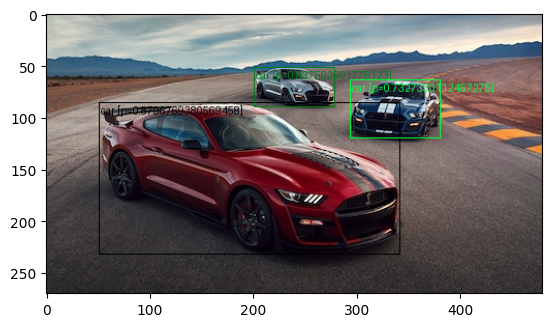
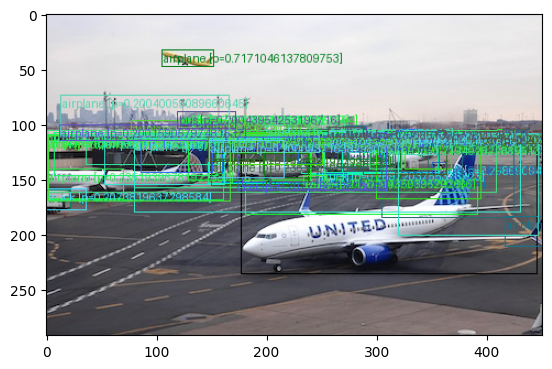

# Object Detection using PyTorch

Detects objects in a given image using a pre-trained Convolutional Neural Network (CNN) model from PyTorch

## How it works

First, we performed model inference on a given image, using model `fcos_resnet50_fpn` with the default weights. This gave us a list of dicts with the bounding boxes, the predicted label, and the confidence scores associated with the box/label. 

Our next step was to plot the bounding boxes produced by the torchvision detection model. We wrote the function `draw_result(img, boxes, labels, scores)` to visualize the results.

## Results

The output of our model using a score threshold of 0.6 on an image of race cars:

The output of our model using a score threshold of 0.01 on an image of planes at an airport:
